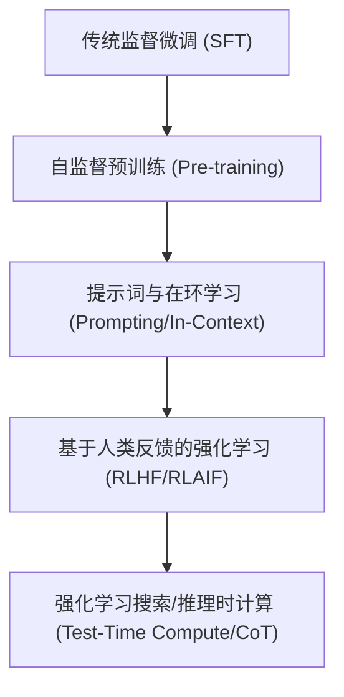

# 人工智能演化史与黄金十年全景图 (2016 - 2026)

> [!NOTE]
> 本报告以 2016 年为起点，梳理至 2026 年 5 月。横跨十年的技术变迁、模型演进、框架交替、公司起伏、产品迭代、关键人物、里程碑论文以及重大新闻，还原一条真实、动态的 AI 演化路线。

---

## 目录
1. [人工智能技术演化图谱：茁壮与衰亡的分支](#一-人工智能技术演化图谱茁壮与衰亡的分支)
2. [黄金十年逐年编年史 (2016 - 2026)](#二-黄金十年逐年编年史-2016---2026)
   - [2016: 深度强化学习的黎明与 AlphaGo 时刻](#2016-深度强化学习的黎明与-alphago-时刻)
   - [2017: Transformer 降临与“注意力”革命](#2017-transformer-降临与注意力革命)
   - [2018: 预训练时代的开端：BERT 与 GPT-1 的对决](#2018-预训练时代的开端bert-与-gpt-1-的对决)
   - [2019: 规模效应初显与 OpenAI 的野心](#2019-规模效应初显与-openai-的野心)
   - [2020: GPT-3 的震撼与科学 AI (AlphaFold 2) 的奇迹](#2020-gpt-3-的震撼与科学-ai-alphafold-2-的奇迹)
   - [2021: 多模态萌芽与开源力量的觉醒](#2021-多模态萌芽与开源力量的觉醒)
   - [2022: ChatGPT 降临，生成式 AI 的“iPhone 时刻”](#2022-chatgpt-降临生成式-ai-的iphone-时刻)
   - [2023: 百模大战与开源 Llama 的燎原之势](#2023-百模大战与开源-llama-的燎原之势)
   - [2024: 多模态原生、Sora 视频风暴与“思考型”模型蓄势](#2024-多模态原生sora-视频风暴与思考型模型蓄势)
   - [2025: DeepSeek 震荡与 Agentic AI 的爆发](#2025-deepseek-震荡与-agentic-ai-的爆发)
   - [2026: 效率革命、具身智能与系统级规范化](#2026-效率革命具身智能与系统级规范化)
3. [核心人物与权力版图的变迁](#三-核心人物与权力版图的变迁)
4. [十年 AI 启示录](#四-十年-ai-启示录)

---

## 一、 人工智能技术演化图谱：茁壮与衰亡的分支

在过去十年中，AI 的底层架构、学习范式和交互方式经历了一次剧烈的“大清洗”。一些曾经被寄予厚望的分支在中途式微，而另一些则成长为统治性的巨木。

### 1. 底层架构的分化与交替
*   **衰亡/退居二线的分支：RNN / LSTM / GRU**
    *   *状况*：2016-2017 年是循环神经网络（RNN）和长短期记忆网络（LSTM）的鼎盛期，几乎垄断了翻译和文本生成。但由于**无法并行训练**以及**长距离依赖遗忘**的硬伤，在 Transformer 出现后迅速被边缘化。
*   **茁壮成长的绝对主线：Transformer**
    *   *状况*：自 2017 年问世以来，Transformer 凭借其自注意力机制（Self-Attention）和极高的并行计算效率，成为几乎所有 LLM、视觉模型（ViT）和多模态模型的通用底层骨架。
*   **新兴的分支：State Space Models (SSM) / Mamba**
    *   *状况*：2023-2024 年，为了解决 Transformer 在超长上下文（$O(N^2)$ 复杂度）下的计算瓶颈，Mamba 等 SSM 架构被提出。虽未完全颠覆 Transformer，但在超长序列和端侧轻量化模型中表现出极强潜力。

### 2. 图像生成范式的替代
*   **衰亡/转向特定领域的分支：GAN（生成对抗网络）**
    *   *状况*：自 2014 年 Ian Goodfellow 发明 GAN 到 2020 年，GAN（如 StyleGAN）是人脸和图像合成的绝对霸主。但由于**训练极不稳定（模式崩溃）**和**无法很好地与文本指令对齐**，在 2022 年后被 Diffusion 架构全面取代，目前仅在实时修复、视频帧内差值和部分判别式任务中作为辅助模块存在。
*   **茁壮成长的绝对主线：Diffusion（扩散模型）**
    *   *状况*：以 DDPM (2020) 和 Latent Diffusion (2021) 为基础，演化出 Stable Diffusion、Midjourney、FLUX.1 以及视频模型 Sora。扩散模型训练稳定、生成多样性强且极易与文本特征空间融合。

### 3. 学习范式的演进

*   **传统路线**：从 2016 年依赖海量标注数据的“监督微调（SFT）”，转向“自监督预训练（Pre-training）”。
*   **对齐革命**：2022 年，基于人类反馈的强化学习（RLHF，如 PPO）和后来的直接偏好优化（DPO）成为模型安全与指令遵循的关键。
*   **推理革命**：2024-2025 年，AI 学习从“拟合人类已有文本”转向“通过强化学习（RL）在自我博弈与探索中学会思考（Reasoning）”，代表是 OpenAI o1/o3 与 DeepSeek-R1，推理时计算（Test-Time Compute）成为新的 Scaling Law。

---

## 二、 黄金十年逐年编年史 (2016 - 2026)

### 2016: 深度强化学习的黎明与 AlphaGo 时刻

2016 年是整个人工智能史上的分水岭。AI 第一次真正破圈，向全球公众展示了超越人类顶尖智力的可能性。

*   **2016-03-09 至 2016-03-15** | **【新闻/里程碑】AlphaGo 世纪大战**：Google DeepMind 的 **AlphaGo** 在韩国首尔与世界围棋冠军李世石（Lee Sedol）进行五番棋对决，最终以 4:1 的总比分获胜。第四局李世石的“神之一手”（第 78 手）成为人类在围棋上击败 AlphaGo 的绝唱。这一事件彻底点燃了全球对深度学习（Deep Learning）和强化学习（Reinforcement Learning）的投资热情。
*   **2016-04-27** | **【技术/框架】OpenAI Gym 发布**：OpenAI 推出开源平台 Gym，用于开发和比较强化学习算法。它迅速成为全球强化学习研究的标准环境，为后续复杂控制和博弈模型的诞生奠定了软件基础。
*   **2016-06** | **【论文】ResNet 荣获 CVPR 最佳论文**：何恺明等人发表的《Deep Residual Learning for Image Recognition》斩获 CVPR 2016 最佳论文。**残差网络（ResNet）**解决了深层神经网络训练中的梯度消失问题，直接推动了计算机视觉（CV）的爆发，至今仍是几乎所有深层网络（包括 Transformer）的标配组件。
*   **2016-09-08** | **【模型】WaveNet 问世**：DeepMind 提出 **WaveNet**，一种用于生成原始音频的深度自回归模型。它将语音合成的自然度提升了 50% 以上，直接应用于 Google Assistant，使机器声音第一次听起来不再像“机器人”。
*   **2016-10** | **【框架】PyTorch 开源发布**：Facebook（现 Meta）人工智能研究院（FAIR）在 GitHub 上开源发布 **PyTorch**（基于 Torch 框架的 Python 移植版）。凭借动态计算图（Dynamic Computation Graph）和极佳的易用性，PyTorch 开始疯狂吞噬 Google TensorFlow 的学术市场。
*   **2016-12** | **【模型/产品】YOLOv2 发布**：Joseph Redmon 等人推出 YOLOv2（YOLO9000），实现了实时目标检测的巨大飞跃，成为工业界自动驾驶、安防监控的核心算法。

---

### 2017: Transformer 降临与“注意力”革命

这一年，AI 历史的命运齿轮开始加速转动。统治下一个十年的通用架构在此时悄然诞生。

*   **2017-02-15** | **【框架】TensorFlow 1.0 发布**：Google 推出 TensorFlow 1.0，虽然在工业界部署中占据统治地位，但由于其静态计算图（Static Graph）设计和繁琐的 API，在学术界正逐渐失去年轻研究者的青睐。
*   **2017-06-12** | **【论文/技术】《Attention Is All You Need》提交 arXiv**：Google 团队（Ashish Vaswani 等 8 位作者）发表论文，提出 **Transformer 架构**。该架构摒弃了 RNN 的循环结构，完全依赖自注意力机制（Self-Attention），实现了并行化计算与长距离上下文的高效建模。这是生成式 AI 时代的奠基石。
*   **2017-10-18** | **【模型】AlphaGo Zero 震惊世界**：DeepMind 在《Nature》发表论文展示 **AlphaGo Zero**。它不需要任何人类棋谱，完全通过“无监督学习”和自我博弈（Self-Play），仅训练 3 天就以 100:0 击败了击败李世石的版本。
*   **2017-10-25** | **【新闻】机器人 Sophia 获得公民身份**：由 Hanson Robotics 开发的类人机器人 Sophia 被沙特阿拉伯授予公民身份，成为历史上第一个获得国家公民身份的机器人。尽管学术界（如 Yann LeCun）批评其为“提线木偶式公关”，但它极大地激发了公众对强人工智能（AGI）的想象与担忧。
*   **2017-12** | **【硬件】NVIDIA Titan V 发布**：基于 Volta 架构的 GPU 问世，首次引入了专门用于加速矩阵乘法的 **Tensor Cores（张量核心）**，标志着 GPU 设计全面向深度学习计算倾斜。

---

### 2018: 预训练时代的开端：BERT 与 GPT-1 的对决

NLP（自然语言处理）领域在这一年迎来了“ImageNet 时刻”。“预训练 + 微调”的范式确立，大厂之间的参数竞赛拉开帷幕。

*   **2018-02** | **【模型】ELMo 提出**：艾伦人工智能研究院（AI2）提出 **ELMo**（Embeddings from Language Models），利用双向 LSTM 根据上下文动态生成词向量，打破了静态词向量（如 Word2Vec）无法解决多义词的瓶颈。
*   **2018-06-11** | **【论文/模型】OpenAI GPT-1 发布**：Alec Radford 等人发表《Improving Language Understanding by Generative Pre-Training》，正式推出 **GPT-1**（1.17 亿参数）。该模型确立了“单向 Transformer 解码器 + 自监督预训练 + 下游微调”的路线。
*   **2018-10-11** | **【论文/模型】Google BERT 霸榜**：Google 团队发表论文《BERT: Pre-training of Deep Bidirectional Transformers for Language Understanding》，推出 **BERT**（3.4 亿参数）。BERT 采用双向 Transformer 编码器结构，在 11 项 NLP 任务上刷新历史纪录。
    *   *路线之争*：**BERT（双向/掩码语言模型）**在理解任务（阅读理解、情感分析）上占绝对优势，成为学术界和工业检索的宠儿；而 **GPT（单向/自回归）**则在生成任务上苦苦支撑，当时被许多人认为不如 BERT 实用。
*   **2018-12-02** | **【科学】AlphaFold 1 初露锋芒**：在 CASP13 蛋白质结构预测比赛中，DeepMind 研发的 **AlphaFold 1** 夺得冠军，准确预测了 43 种蛋白质中 25 种的结构，开启了 AI for Science（科学人工智能）的新纪元。
*   **2018-12-18** | **【模型/博弈】AlphaStar 击败人类职业选手**：DeepMind 的 **AlphaStar** 在《星际争霸 2》中以 10:1 击败人类职业选手，证明了 AI 在不完全信息、实时决策和复杂策略空间中的统治力。

---

### 2019: 规模效应初显与 OpenAI 的野心

OpenAI 顶住 BERT 带来的压力，坚定地走向了单向自回归与“大模型”路线。

*   **2019-02-14** | **【新闻/模型】GPT-2 发布与“封印”风波**：OpenAI 宣布 **GPT-2**（15 亿参数，较 GPT-1 扩大 10 倍）。因其生成的文本过于逼真、难以分辨真伪，OpenAI 以“防止恶意使用”为由，宣布暂不开源完整模型，仅发布迷你版本。这一举动在开源社区引发了关于“AI 安全 vs 开源精神”的空前大辩论。
*   **2019-03** | **【人物】深度学习三巨头荣获 Turing 奖**：Yoshua Bengio、Geoffrey Hinton 和 Yann LeCun 被授予图灵奖，表彰他们在深度神经网络领域的概念和工程突破，这标志着深度学习被计算机主流科学界完全认可。
*   **2019-07-22** | **【公司/新闻】微软 10 亿美元注资 OpenAI**：微软宣布向 OpenAI 投资 10 亿美元，双方达成独家合作。OpenAI 将其模型运行在微软 Azure 云计算平台上，这一长盟为日后微软全面转向生成式 AI 埋下了伏笔。
*   **2019-07** | **【模型】RoBERTa 诞生**：Meta 开源 **RoBERTa**，通过更长的时间、更大的 Batch Size 以及动态掩码策略对 BERT 进行极限优化，再次刷爆 NLP 榜单，证明了单纯增加预训练数据量和训练时长对编码器模型依然有效。
*   **2019-09** | **【框架】TensorFlow 2.0 发布**：Google 彻底重构 TensorFlow，将 Eager Execution（动态图模式）设为默认，并深度整合高级 API Keras。尽管做出了挽救，但在学术界的研究者早已大量流向 PyTorch。
*   **2019-10** | **【模型】T5 (Text-to-Text Transfer Transformer)**：Google 发布 **T5**，将所有 NLP 任务（翻译、分类、问答）统一建模为“文本到文本”的生成任务，进一步统一了 NLP 的下游范式。
*   **2019-11-05** | **【模型】OpenAI 解封 GPT-2 完整模型**：在经历 9 个月的迭代观察后，OpenAI 认为未发现大规模滥用迹象，正式开源了 1.5B 的完整 GPT-2 模型。

---

### 2020: GPT-3 的震撼与科学 AI (AlphaFold 2) 的奇迹

这一年，“参数规模（Scaling Law）”被证实是通往智能涌现的黄金法则。AI 在科学领域的应用也迎来了突破性进展。

*   **2020-05-28** | **【论文/模型】GPT-3 问世与“涌现”能力的发现**：OpenAI 发表《Language Models are Few-Shot Learners》，推出 **GPT-3**（1750 亿参数，较 GPT-2 暴增 100 倍以上）。
    *   *技术质变*：GPT-3 展现出惊人的 **In-Context Learning（上下文学习/少样本提示）** 能力。用户无需对下游任务进行任何微调（Fine-Tuning），只需通过几句 Prompt（提示词），模型就能理解并执行从未见过的任务。
*   **2020-06** | **【公司】OpenAI 商业化与非盈利属性的动摇**：OpenAI 推出首个商业 API 接口，允许开发者接入 GPT-3。此举引发了早期创始人（如 Elon Musk）的猛烈批评，指责 OpenAI 违背了创立时“非盈利和技术公开”的初衷。
*   **2020-10-22** | **【论文/模型】Vision Transformer (ViT) 颠覆视觉领域**：Google 团队在 arXiv 发表论文《An Image is Worth 16x16 Words》。ViT 将图像分割为 $16 \times 16$ 的 Patch，直接输入标准 Transformer 编码器。ViT 证明了在海量数据预训练下，Transformer 可以完全取代 CNN，一统 CV 与 NLP 的底层架构。
*   **2020-11-30** | **【科学/里程碑】AlphaFold 2 完美解决蛋白质折叠问题**：在 CASP14 挑战赛上，DeepMind 的 **AlphaFold 2** 取得了 90 分以上的 GDT 成绩（中位数误差仅为 1.6 埃，相当于原子级别精度），被公认为彻底解决了困扰生物学家 50 年之久的“蛋白质折叠之谜”。
*   **2020-12** | **【新闻】Google 伦理学家被解雇风波**：Google 伦理 AI 团队联合负责人 Timnit Gebru 因撰写论文《On the Dangers of Stochastic Parrots: Can Language Models Be Too Big? 🦜》（批评大模型消耗资源、存在偏见与逻辑死循环）与公司管理层发生冲突，最终被 Google 解雇。这引发了学术界对科技巨头垄断 AI 话语权和压制学术自由的强烈抗议。

---

### 2021: 多模态萌芽与开源力量的觉醒

文本与图像的跨界融合在这一年完成技术铺垫，代码生成也迎来了革命性的工具。

*   **2021-01-05** | **【模型/技术】DALL-E & CLIP 双子星发布**：OpenAI 推出 **DALL-E**（将文本与图像离散 Token 化后混合输入的生成模型）和 **CLIP**（Contrastive Language-Image Pre-training）。
    *   *技术意义*：CLIP 建立了文本特征空间与图像特征空间的强关联，成为后来 Stable Diffusion、Midjourney 等几乎所有文本生成图像模型的“导航仪”。
*   **2021-03** | **【开源】EleutherAI 吹响开源反攻号角**：非盈利研究组织 EleutherAI 推出 **GPT-Neo**（2.7B 参数），随后在 6 月发布 **GPT-J**（6B 参数），力图打破 OpenAI 对百亿、千亿级大模型的垄断。
*   **2021-06-01** | **【模型】悟道 2.0 (WuDao 2.0)**：北京人工智能研究院（BAAI）发布万亿参数多模态稀疏模型，展示了中国团队在超大规模混合专家架构（MoE）上的工程实力。
*   **2021-06-29** | **【产品】GitHub Copilot 预览版发布**：GitHub 联合 OpenAI 推出 Copilot。该工具基于在开源代码库上训练的 **OpenAI Codex** 模型，实现了在编辑器内自动生成完整代码块的功能，瞬间改变了全球程序员的日常开发流。
*   **2021-07-15** | **【开源/科学】AlphaFold 2 开源与结构数据库公布**：DeepMind 宣布开源 AlphaFold 2 源代码，并在《Nature》上免费公布了人类及 20 种模式生物的蛋白质结构预测数据库，引发全球结构生物学研究的集体爆发。

---

### 2022: ChatGPT 降临，生成式 AI 的“iPhone 时刻”

这是人工智能历史上最为辉煌、最具有戏剧性的一年。生成式 AI 从专业工具演变为全球性的社会现象。

*   **2022-01-27** | **【技术/模型】InstructGPT 开启对齐时代**：OpenAI 发布 **InstructGPT**，引入 **基于人类反馈的强化学习 (RLHF)**。通过 PPO 算法，让模型学会生成更安全、更有用、更符合人类意图的回复，大幅缓解了 GPT-3 满嘴胡话（Hallucination）的问题。
*   **2022-04-06** | **【模型】DALL-E 2 掀起艺术巨浪**：OpenAI 宣布 **DALL-E 2**，采用 **Diffusion（扩散）** 架构，可生成高分辨率、极具艺术感的图像。
*   **2022-07-12** | **【产品】Midjourney 进入公测**：Midjourney 宣布在 Discord 上开放公测，凭借独特的艺术调教风格和极其便利的使用场景，迅速在插画、广告设计行业引发巨大变革。
*   **2022-08-22** | **【开源/里程碑】Stable Diffusion 彻底开源**：Stability AI、Runway 和慕尼黑大学合作开源 **Stable Diffusion v1**。任何人都可以下载模型并在家用显卡上运行。
    *   *影响*：引发了全球 AI 生成艺术（AIGC）的超级大爆发，但也带来了前所未有的版权诉讼风暴（如 Getty Images 起诉 Stability AI）以及 Deepfake 虚假信息的滥用忧虑。
*   **2022-09-21** | **【开源】Whisper 语音模型开源**：OpenAI 开源语音识别模型 Whisper，其在多语言翻译和转录上的极高准确度，迅速被集成至各种剪辑和翻译软件中。
*   **2022-11-15 至 2022-11-17** | **【事件/衰亡】Meta Galactica 短命上线**：Meta 推出专门用于科学研究的语言模型 Galactica，并上线公测网页。由于该模型能以极度自信的口吻生成胡说八道的“假论文”和虚假公式，遭遇科学界强烈抗议，仅存活 3 天（17 日）就被迫紧急下线。
*   **2022-11-30** | **【产品/里程碑】ChatGPT 横空出世**：基于 GPT-3.5 架构，OpenAI 上线了网页端 **ChatGPT** 的免费试用。
    *   *社会奇迹*：发布仅 **5 天** 用户突破 100 万；**两个月** 内月活跃用户突破 1 亿，成为互联网历史上用户增长最快的消费级应用。它将复杂的“提示词工程”简化为极其自然的聊天界面，标志着大众 AI 时代的全面开启。

---

### 2023: 百模大战与开源 Llama 的燎原之势

硅谷及全球科技巨头陷入疯狂竞赛，同时开源力量完成了对闭源生态的第一次强力合围。

*   **2023-01-23** | **【新闻/公司】微软追投 OpenAI 100 亿美元**：微软确认与 OpenAI 开启第三阶段合作，追加投资达 100 亿美元，并将 GPT-4 深度嵌入微软全家桶（Bing、Office 365 Copilot），直接挑起与 Google 的正面大战。
*   **2023-02-06** | **【新闻/产品】Google 仓促迎战 Bard**：Google 宣布推出实验性对话服务 Bard（基于 LaMDA 模型）。在发布会的演示视频中，Bard 犯了一个常识性错误（关于詹姆斯·韦伯空间望远镜的发现），导致 Google 母公司 Alphabet 股价暴跌超 7%，市值蒸发超 1000 亿美元。
*   **2023-02-24** | **【开源/里程碑】Meta LLaMA 开源与“泄露”事件**：Meta AI 推出 **LLaMA 1** 系列模型（7B 到 65B 参数）。最初仅向学术界开放，但几天后权重文件在 4chan 上被泄露。
    *   *燎原之势*：这次泄露直接催生了开源大模型生态的“寒武纪大爆发”。斯坦福大学在一周内用 $500 训练出 Alpaca（羊驼），随后 Vicuna、Koala 等基于 Llama 的模型雨后春笋般涌现，证明了“小模型 + 高质量微调”可以逼近 GPT-3.5 的效果。
*   **2023-03-14** | **【模型/里程碑】GPT-4 正式发布**：OpenAI 推出 **GPT-4**。该模型具有多模态理解力，支持图像输入，在律师考试（Bar Exam）、SAT 考试中成绩超越 90% 的人类，具备了前所未有的高级推理、逻辑推导和复杂指令遵循能力。
*   **2023-07-18** | **【开源】Llama 2 免费商用**：Meta 联合微软发布 **Llama 2**。这一次，Meta 明确授权商业使用，消除了企业的合规隐忧，开源大模型正式进入企业级生产力落地阶段。
*   **2023-11-17 至 2023-11-22** | **【新闻/事件】OpenAI “宫斗”风波**：
    *   *11-17（周五）*：OpenAI 董事会突然宣布解雇 CEO Sam Altman，并罢免总裁 Ilya Sutskever 的董事长职务。原因据称是“Altman 在沟通中不坦诚”。
    *   *11-18 至 11-20*：微软 CEO 萨提亚·纳德拉迅速介入，宣布将 Altman 和 Greg Brockman 招入微软领导新 AI 团队。同时，OpenAI 近 700 名员工（占总数 90% 以上）签署联名信，要求董事会辞职并迎回 Altman，否则集体跳槽微软。
    *   *11-21 至 11-22*：董事会妥协，Sam Altman 重返 OpenAI 担任 CEO，前财长萨默斯等人加入新董事会。Ilya Sutskever 逐渐淡出核心权力层（并在 2024 年离职）。
*   **2023-12-06** | **【模型】Google Gemini 1.0 发布**：Google 宣布推出 **Gemini** 家族，号称首个“原生多模态”大模型，在 MMLU 等多项测试上宣称超越 GPT-4。

---

### 2024: 多模态原生、Sora 视频风暴与“思考型”模型蓄势

大语言模型的竞争维度从单纯的文本生成，拓展到了物理世界模拟和人类自发思考的深度领域。

*   **2024-02-15** | **【产品/模型】Sora 视频模型发布**：OpenAI 震撼公布文本生成视频模型 **Sora**。Sora 能生成长达 60 秒的视频，包含复杂的相机运动、多角色互动以及逼真的物理世界常识，被业内称为“物理世界模拟器”。
*   **2024-02-15** | **【模型】Gemini 1.5 Pro 推出百万上下文**：Google 同日发布 Gemini 1.5 Pro，将上下文长度暴力拉升至 **100 万（甚至 200 万）Token**，能一次性吞下整部《指环王》或数万行代码，开辟了“长上下文”新战场。
*   **2024-03-04** | **【模型】Claude 3 系列发布，超越 GPT-4**：Anthropic 推出 Claude 3（Haiku、Sonnet、Opus）。其旗舰模型 Opus 在多项推理和代码指标上历史性地超越了 GPT-4，树立了闭源大模型的新标杆，并以“同理心高、文笔流畅”获得广泛赞誉。
*   **2024-04-18** | **【开源】Llama 3 震撼登场**：Meta 推出 **Llama 3** (8B / 70B)。其中 8B 模型展现了极强的指令理解力，成为全球开源开发者的新标配。7 月，Meta 推出 **Llama 3.1 405B**，这是开源史上最大的模型之一，性能直逼闭源旗舰。
*   **2024-05-13** | **【模型/产品】GPT-4o 交互革命**：OpenAI 举行春季新品发布会推出 **GPT-4o**（“o”代表 omni，全能）。该模型将文本、语音和视觉合为同一神经网络，实现了实时的语音对话，延迟缩短至 232 毫秒（相当于人类水平），并能识别用户的面部表情和语气波动。
*   **2024-08** | **【开源】FLUX.1 颠覆图像生成**：由 Stability AI 前核心研发团队创办的 Black Forest Labs 发布开源图像模型 **FLUX.1**。其极其精准的文字渲染和细节控制，超越了 Midjourney v6，成为开源文生图的新霸主。
*   **2024-09-12** | **【模型/技术】OpenAI o1 开启“强化学习推理”时代**：OpenAI 发布代号为 Strawberry 的 **o1-preview** 和 **o1-mini**。
    *   *技术转向*：o1 不再“脱口而出”回复，而是引入**思考链（Chain of Thought）**，在输出前进行内部推理、自我纠错和尝试不同解法。这种设计将 AI 的能力边界从“直觉回答”推向了“数理逻辑推理”，开启了依靠推理时计算（Test-Time Compute）突破性能瓶颈的下一代 Scaling Law。
*   **2024-11-25** | **【框架/开源】Model Context Protocol (MCP) 发布**：Anthropic 推出 **模型上下文协议 (MCP)**。这是一个旨在解决 AI 模型与具体数据源、本地工具及服务之间“信息烟囱”的统一协议，成为后续 Agentic AI 的核心管道。
*   **2024-12-26** | **【模型/公司】DeepSeek-V3 惊艳全球**：杭州深度求索（DeepSeek）公司发布开源模型 **DeepSeek-V3**（6710 亿参数，混合专家架构 MoE）。其在性能上与西方顶尖闭源模型并驾齐驱，但训练所消耗的 GPU 算力和资金仅为西方同级别大模型的几分之一（据传训练成本仅 560 万美元）。

---

### 2025: DeepSeek 震荡与 Agentic AI 的爆发

AI 的计算效率、高性价比和“自主规划”能力在这一年发生了彻底改变。

*   **2025-01-20** | **【模型/里程碑】DeepSeek-R1 掀起全球效率海啸**：DeepSeek 发布开源推理模型 **DeepSeek-R1**。
    *   *DeepSeek 震撼*：R1 采用类似 OpenAI o1 的强化学习推理技术，在数学、代码等逻辑任务上直接与 o1 平起平坐。更震撼的是，DeepSeek 完全开源了其训练权重以及创新的算法（如 GRPO 算法，省去了昂贵的评论家网络 Critic Network，极大地降低了 RL 的显存消耗）。这在全球范围内引发了关于“AI 军备竞赛是否需要无限资金”的深度重估，甚至引发了纳斯达克科技股的剧烈波动。
*   **2025-02 至 2025-03** | **【模型】美系巨头大反击**：
    *   OpenAI 发布 **o3** 完整版，极大地增强了科学竞赛和软件工程方面的推理精度。
    *   Anthropic 推出 **Claude 4/Opus 4.5**，集成强大的原生 MCP 协议，全面转型 Agent 运行平台。
    *   Google 升级 **Gemini 2.0 Pro**，在音视频实时多模态交互和长推理链条上表现优异。
*   **2025-04** | **【框架】MCP 转交 Linux 基金会**：为了打破巨头生态壁垒，Anthropic 将 Model Context Protocol（MCP）的所有权和治理权转交给 Linux 基金会。该协议的下载量在 2025 年末突破数千万次，成为 AI Agent 底层交互的“USB 接口”。
*   **2025 下半年** | **【技术/趋势】Agentic AI 的井喷**：随着底层模型推理能力的成熟以及 MCP 协议的统一，AI 的竞争彻底从“Chat（聊天机器人）”转向“Agent（智能体）”。企业开始大规模部署能够自主调用 API、规划复杂任务步骤、编写代码并自我验证纠错的智能体系统。

---

### 2026: 效率革命、具身智能与系统级规范化

（注：以当前 2026 年 5 月底的视角来看）

AI 技术正加速向硬件物理端渗透，且监管法律与商业化范式正式步入法治与成熟期。

*   **2026-01-15** | **【产品/新闻】AI 独立硬件的谢幕与“网关化”**：2024 年风光一时的独立 AI 硬件 Humane AI Pin 和 Rabbit R1 在经历两年的挣扎后，因硬件易用性差、电池寿命及纯靠云端 API 的延迟瓶颈而走向落幕。产业共识形成：AI 应该作为“Local Gateway（本地网关）”常驻在手机、电脑 OS（如 Windows Copilot, Apple Intelligence）以及 AR 眼镜中，而非单独买一个不成熟的物理设备。
*   **2026-03-16** | **【硬件/计算】NVIDIA GTC 2026 与 Blackwell 时代**：黄仁勋在 GTC 2026 上宣布 **Blackwell GPU** 全面进入量产部署，并透露了 Rubin 架构的新进展。同时，台积电等代工厂的 2nm 制程处理器开始小规模量产，使得单位算力的功耗下降了 30%。
*   **2026-04** | **【法规】EU AI Act 严厉执行与首批诉讼和解**：欧盟《人工智能法案》（EU AI Act）全面落地执行，各大 AI 公司面临严格的版权来源披露和合规检查。全球首批 AIGC 版权诉讼案达成法庭外和解，确立了“版权授权数据库 + 合规收益分成”的商业共识。
*   **2026-05** | **【具身智能】“大脑”走入“躯壳”**：随着 DeepSeek-R1、o1 等强推理模型的端侧蒸馏版成功运行在本地芯片上，具身智能（Embodied AI）迎来重大飞跃。Figure 03 和 Tesla Optimus Gen 3 等 humanoid 机器人已能在汽车生产线上执行轻度自主装配和物料配送，标志着 AI 物理化的序幕正式揭开。

---

## 三、 核心人物与权力版图的变迁

这十年也是 AI 领袖们在权力、资本、理念和伦理中博弈的群星闪耀史。

| 人物 | 主要身份/关联机构 | 十年间关键轨迹 |
| :--- | :--- | :--- |
| **Sam Altman** | OpenAI 联合创始人/CEO | 带领 OpenAI 从非盈利组织转型为商业巨头。历经 2023 年“11.17 宫斗”后重掌大权，成为硅谷最具权势的 AI 教父。 |
| **Demis Hassabis** | Google DeepMind 创始人/CEO | 围棋 AI (AlphaGo)、科学 AI (AlphaFold 1/2/3) 的幕后推手，在 Google 内部整合后掌管 Google AI 的全部核心研发。 |
| **Ilya Sutskever** | OpenAI 前首席科学家 / SSI 创始人 | 深度学习泰斗，GPT 核心技术架构设计者。因对 AI 安全的深切担忧参与罢免 Sam Altman。宫斗平息后出走，创办“安全超级智能 (SSI)”公司。 |
| **Yann LeCun** | Meta 首席 AI 科学家 | 卷积神经网络 (CNN) 先驱。过去十年一直担任开源大模型的强力辩护者，常年与 Sam Altman、Geoffrey Hinton 发生学术论战，坚持“自回归 LLM 无法通往真正 AGI，世界模型才是未来”的观点。 |
| **Geoffrey Hinton** | 多伦多大学教授 / 前 Google 研究员 | 深度学习之父。2023 年高调从 Google 辞职，以便“自由地对 AI 毁灭人类的潜在风险发出警告”，从坚定的技术推动者转变为悲观的安全游说者。 |
| **梁文锋 (Liang Wenfeng)** | 深度求索 (DeepSeek) 创始人 | 2024-2025 年的黑马人物。倡导极致的算法优化与开源精神，用极小预算击碎了美系大厂的“算力垄断”神话。 |

---

## 四、 十年 AI 启示录

回顾这十年的演化史，我们可以总结出几个核心规律：

1.  **Scaling Law 的韧性与变形**：
    从 2020 年 GPT-3 发现参数、数据与算力的简单 scaling law，到 2024 年遭遇数据枯竭、电网瓶颈。技术的突围方向最终从**“预训练算力（Train-Time Compute）”**转向了**“推理时算力（Test-Time Compute）”**。让模型学会“思考”代替了盲目增加模型参数。
2.  **开源与闭源的螺旋上升**：
    每当闭源模型（如 GPT-4）拉开代差，开源社区就会通过 Meta Llama、EleutherAI 以及 DeepSeek 进行饱和式反攻。开源消除了大模型的技术霸权，使 AI 迅速变成普惠的社会基础设施。
3.  **应用形态的重塑**：
    十年间，人类对 AI 的期望从“替代低端脑力劳动的 Chatbot”升级为“拥有反思和规划能力的 Agent”，再到“具备物理交互能力的具身智能”。AI 正在从工具演变成全自主的数字合伙人。
